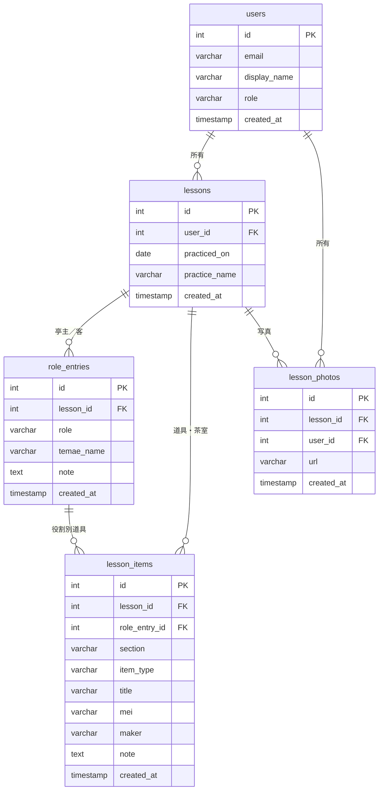

# 稽古記録アプリ — Urasenke Practice Log

裏千家のお稽古を記録・振り返るためのWebアプリです。
スマートフォンからも使えるので、稽古の直後にその場で記録できます。

---

## できること

### 稽古を記録する
稽古日・季節・使用した道具を、タブ形式で整理して記録します。

**茶室タブ**
- お菓子（御生・銘）
- 掛け軸
- 花
- その他（自由に項目追加可）

**亭主タブ / 客タブ（それぞれ独立して入力）**
- お茶の種類（薄茶 / 濃茶）
- 棚の有無・棚名
- 稽古名（例：貴人点て、大円草）
- 茶碗（御生・作者・銘・メモ）
- 茶杓（作者・銘・メモ）
- 茶器（塗り・形 / 濃茶の場合は窯元）
- 仕覆（切地・仕立て）※濃茶のみ
- メモ

亭主と客で**別々に**お茶の種類・棚・稽古名を設定できるのがポイントです。

### 稽古を振り返る
過去の稽古を一覧で確認できます。

- 年・月のプルダウンで絞り込み
- キーワード検索（道具名・銘・作者・メモなど**すべての入力内容**が対象）

### アルバム
稽古中に撮った写真を管理します。

- 写真をアップロードして稽古に紐付け
- サムネイル一覧で見やすく表示（日付・稽古名付き）
- 写真をタップすると拡大表示＋該当の稽古へリンク
- アルバム画面から直接アップロードも可能

---

## 凄いところ

### 亭主と客で独立した記録
同じ稽古でも、亭主として薄茶の平点前、客として濃茶の大円草を学んだ場合、それぞれ独立して記録できます。従来のノートや一般的なメモアプリでは管理しにくかった「役割ごとの記録」をシームレスに実現しています。

### 道具の横断検索
「この茶碗、前にも使ったな」という時に、銘や作者の一部をキーワードで入力するだけで、過去のすべての稽古から該当する記録を瞬時に見つけられます。稽古名だけでなく、道具のあらゆる情報が検索対象です。

### 写真と記録の連携
アルバムの写真から、その日の稽古記録へ直接飛べます。道具の写真と文字の記録が一体となって管理できます。

### スマートフォン対応
稽古の場でその場で記録できるよう、スマートフォンからでも快適に使えます。

---

## 技術構成

| 項目 | 使用技術 |
|------|---------|
| フロントエンド | Next.js 15 (App Router) / TypeScript |
| バックエンド | FastAPI (Python) |
| データベース | Supabase (PostgreSQL) |
| 認証 | Supabase Auth（メール＋パスワード / Google OAuth） |
| 画像ストレージ | Cloudinary |
| フロントホスティング | Vercel |
| バックエンドホスティング | Render |

---

## 認証・複数人対応

### ログイン方法
- **メール＋パスワード**によるログイン
- **Google アカウント**によるソーシャルログイン
- **招待制**：Supabase Authentication から管理者が招待メールを送ってアカウントを発行

### デモモード
ログイン画面の「**デモを試す**」ボタンを押すと、共有デモアカウントの認証情報が自動入力されます。
「ログイン」を押すだけでアカウント登録なしにアプリを体験できます。

> デモアカウントのデータは複数人で共有されます。実際の稽古記録には個人アカウントをご利用ください。

### データの分離
各ユーザーは自分の稽古記録・写真のみ閲覧・編集できます。
他のユーザーのデータにはアクセスできない設計になっています。

### ユーザー追加方法（管理者向け）
Supabase ダッシュボード > **Authentication** > **Users** > **Invite user** からメールアドレスを入力して招待します。

---

## データバックアップ

### 自動バックアップ（GitHub Actions）
毎週月曜 AM10:00（JST）に自動でデータをエクスポートします。

| 項目 | 内容 |
|------|------|
| 対象テーブル | users / lessons / role_entries / lesson_items / lesson_photos |
| 保存形式 | CSV |
| 保存先 | `tea_ceremony_back` リポジトリの `backups/` フォルダ |
| 設定ファイル | `.github/workflows/backup.yml` |

### バックアップの確認方法
GitHub > `tea_ceremony_back` > `backups/` フォルダを開くと各テーブルの CSV が確認できます。

### 手動実行
GitHub > `tea_ceremony_back` > **Actions** > **Weekly Database Backup** > **Run workflow** から任意のタイミングで実行できます。

---

## 将来の拡張予定

- **言語切り替え**（日本語 / 英語）— 外国人の方にも使えるように
- **クラス共有**— クラス単位で写真や記録を共有
- **管理者権限**— 師匠がクラス全体の記録を俯瞰できる機能

データベース設計はこれらの拡張を見越した構造になっています。

---

## 後から手を入れると負担が大きくなる箇所

現在は個人利用のMVPとして割り切った設計をしている部分があります。
拡張を検討する際は、以下の点を優先的に対応することを推奨します。

### 1. ~~`user_id = 1` のハードコード~~ → **解決済み**
全エンドポイントでログインユーザーの ID を動的に取得するよう修正済みです。

### 2. `temae_name` の複合文字列形式（優先度：中）
稽古名・茶種・棚の情報を `薄茶/なし/貴人点て` という1カラムの文字列に埋め込んでいます。
「濃茶の稽古だけを絞り込む」などの構造的なクエリが難しく、データが増えるほどパース処理への依存が深まります。
将来的にはカラム分割またはJSONB型への移行が望ましいです。

### 3. ~~認証ミドルウェアの不在~~ → **解決済み**
Supabase Auth（JWT）による認証を全エンドポイントに導入済みです。

### 4. Cloudinaryの署名なしアップロード（優先度：中・複数人対応時）
現在、フロントエンドから直接Cloudinaryへアップロードできる設定（unsigned preset）になっています。
個人利用では問題ありませんが、多ユーザー化すると第三者による無制限アップロードのリスクが生まれます。
対応策：バックエンド経由の署名付きアップロードに切り替える。

### 5. 削除→再作成による上書き保存（優先度：低）
編集保存時に既存の道具データをすべて削除して再登録しています。
このため変更履歴が残りません。
将来的に「以前はどんな道具を使っていたか」を時系列で追いたい場合は、スキーマ変更が必要です。

---

## データベース設計



> `role_entries.temae_name` には `薄茶/なし/貴人点て` の形式で茶種・棚・稽古名を格納し、亭主と客で独立して管理しています。
> `lesson_items.role_entry_id` が NULL の場合は茶室（chashitsu）アイテムとして扱います。

---

## ディレクトリ構成

```
tea_ceremony_app/
├── frontend/frontend/   # Next.js アプリ
│   └── app/
│       ├── page.tsx           # トップ画面
│       ├── lessons/           # 稽古記録・一覧
│       └── photos/            # アルバム
└── backend/             # FastAPI アプリ
    ├── main.py          # APIエンドポイント
    └── db.py            # データベース接続
```
